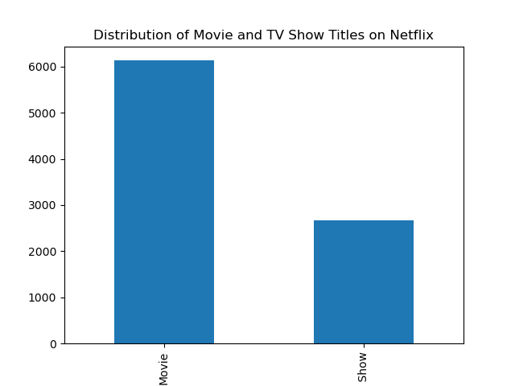
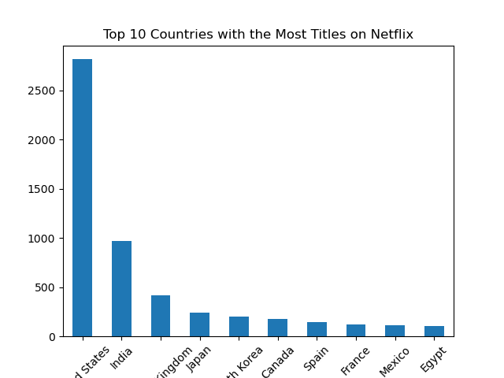
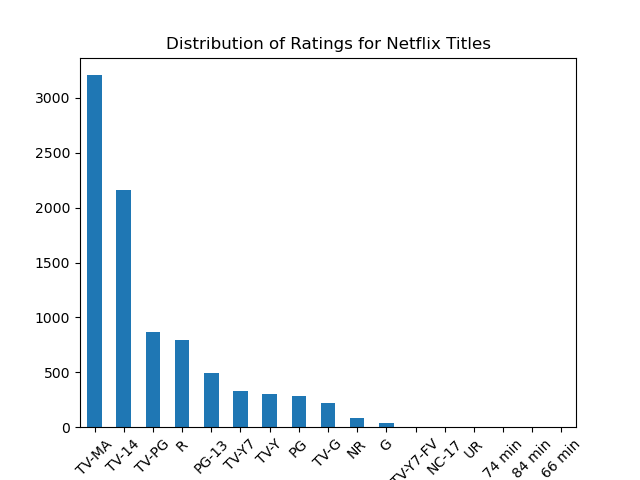

# Netflix Content Analysis

## Overview

This project explores a public Netflix catalogue containing 8,807 movies and TV shows. It combines a reproducible Python visualization script with a set of SQLite analysis queries.

## Questions explored

- How is the catalogue split between movies and TV shows?
- Which country fields and ratings appear most often?
- How has the number of titles changed by release year?
- Which directors and content categories occur most frequently?

## Key findings

- Movies outnumber TV shows in the dataset.
- United States entries form the largest country group.
- TV-MA and TV-14 are the most common ratings.
- The catalogue contains substantially more titles released after 2015 than in earlier years.

Country and genre fields can contain comma-separated values. The current analysis treats each complete field value as one category; splitting multi-value fields is a useful next improvement.

## Visualizations

### Movies and TV shows



### Top country fields



### Ratings



## Project structure

```text
netflix-content-analysis/
├── data/
│   └── netflix_titles.csv
├── images/
├── python/
│   └── visualization.py
├── sql/
│   ├── analysis.md
│   └── queries.sql
└── README.md
```

## Run the Python analysis

From this project directory:

```bash
python python/visualization.py
```

The script reads `data/netflix_titles.csv` and refreshes the charts in `images/`.

## Run the SQL analysis

Import `data/netflix_titles.csv` into SQLite as a table named `netflix_titles`, then run `sql/queries.sql`. The queries use SQLite syntax, including `PRAGMA`.

## Dataset

The CSV is the commonly used Kaggle Netflix Movies and TV Shows dataset. It is included here so the analysis remains reproducible. Before republishing or extending the project, verify and document the dataset's original author and license on its source page.
